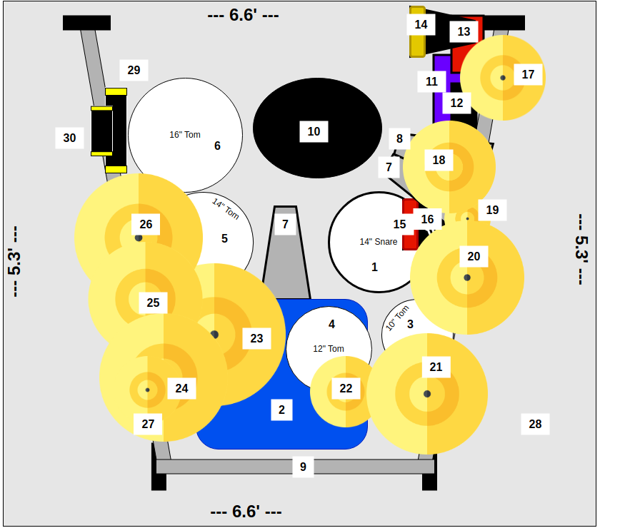

# Drums... A love story.

Ever since I was a kid, I loved seeing the drum configurations of my favorite drummers. I would find them online or in Modern Drummer magazine and meticulously scrutinize every piece. Many years later, I decided to make my own.

This is a pretty simple design, but it really is reminiscent of the diagrams from my youth. I made the drum diagram using [draw.io (diagrams.net)](https://www.drawio.com/). I used basic shapes (squares, circles, lines, etc.) to represent the drums, cymbals, hardware, etc. I kept the ratios by multiplying the inches of the item by 10 and using that as a pixel count. So a 20" cymbal would be 200 px. The design is composed of two layers. The first is the drum set design. The second is the numbers for each item.

# My Drum Set

## Drums

1. DW 14" x 6.5" Copper Snare
   1. Microphone: Shure Beta 56A
2. Yamaha Birch Custom Absolute Nouveau 22" x 18" Bass Drum
   1. Microphone: Shure Beta 52A (Suspended inside drum using Kelly SHU Microphone Mounting System)
   2. Tuning: D1 (36hz)
3. Yamaha Birch Custom Absolute Nouveau 10" x 8" Rack Tom
   1. Microphone: Shure Beta 98AMP/C
   2. Tuning: D3 (147hz)
4. Yamaha Birch Custom Absolute Nouveau 12" x 9" Rack Tom
   1. Microphone: Shure Beta 98AMP/C
   2. Tuning: B2 (124hz)
5. Yamaha Birch Custom Absolute Nouveau 14" x 12" Rack Tom
   1. Microphone: Shure Beta 98AMP/C
   2. Tuning: G2 (98hz)
6. Yamaha Birch Custom Absolute Nouveau 16" x 14" Rack Tom
   1. Microphone: Shure Beta 98AMP/C
   2. Tuning: D2 (73hz)

## Pedals

7. DW 9000 Series Double Bass Pedal
8. DW 9000 Series Heavy Duty 2-Leg Hi-Hat Stand
9. Pearl Icon Drum Rack

## Drum Throne

10. DW Tractor Style Airlift Drum Throne w/ Backrest

## Percussion

11. LP Guiro Jam Block (Purple)
12. LP 35th Anniversary High Jam Block (Black)
13. LP Medium Jam Block (Red)
14. LP 8" Rock Ridge Rider Cowbell
15. LP 8" Ridge Rider Cowbell
16. LP Cyclops Mounted Tambourine (Steel)

## Cymbals

17. Zildjian 11" Oriental Trash Splash
18. Zildjian 13" Mastersound Hi-Hats
    1. Top: Zildjian 13" A Custom Mastersound Bottom Hi-Hat
    2. Bottom: Zildjian 13" K Custom Mastersound Bottom  Hi-Hat
    3. Microphone: Shure SM137
19. Zildjian 6" Small Zil Bel (Piggybacked on tambourine)
20. Zildjian 17" K Sweet Crash
21. Zildjian 17" A Custom Projection Crash
    1. Microphone: Shure SM137
22. Zildjian 10" A Custom Splash
23. Zildjian 20" K Custom Dark Ride
24. Zildjian 18" A Zildjian Heavy Crash
    1. Microphone: Shure SM137
25. Zildjian 16" A Custom Fast Crash
26. Wuhan 18" China Cymbal
27. Zildjian 9.5" Large Zil Bel

## Miscellaneou
28. DW Large Drum Rug - 5.3' x 6.6'

## Vocal Microphone

Shure Beta 56A mounted on an Ultimate Support MC-125 Studio Microphone Boom Stand